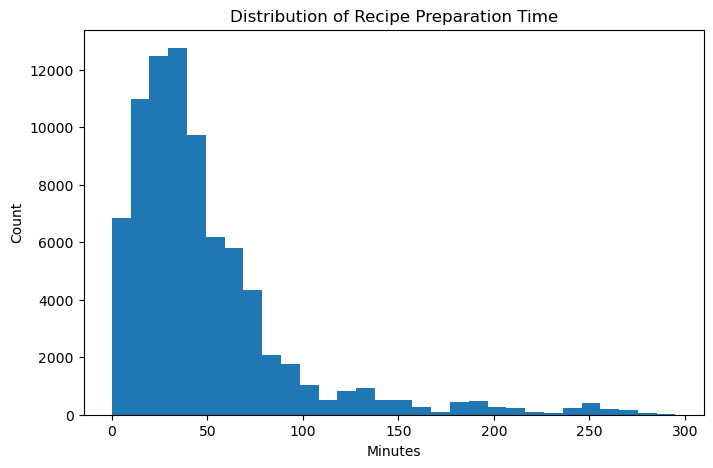
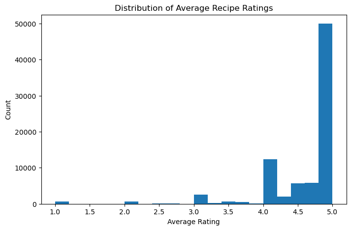
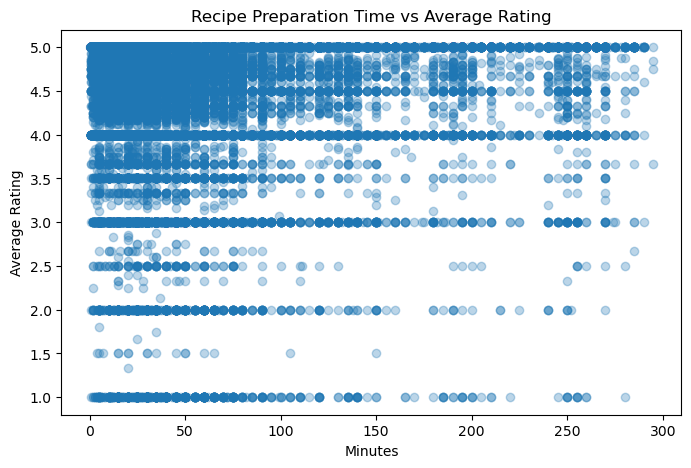
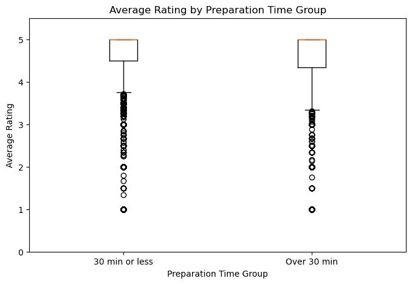

# Do Faster Recipes Receive Higher Ratings?

**Authors:** Roxanne Wang & Ryan Zhang  
**Course:** DSC 80 — Final Project  
**Live Website:** [https://wwroxanne219.github.io/food-recipe-analysis/](https://wwroxanne219.github.io/food-recipe-analysis/))

---

## Introduction

This project analyzes the **Food.com Recipes and Ratings dataset**, which combines recipe-level information from Food.com with user-submitted ratings and reviews. The recipes dataset contains attributes like preparation time, number of steps, number of ingredients, nutritional information, and tags. The interactions dataset records individual user ratings (1–5) linked to each recipe by ID.

After merging and cleaning, the combined dataset contains **[ADD TOTAL ROW COUNT] rows**, where each row represents one recipe with its associated average rating.

Our central question is:

> **Do recipes that take 30 minutes or less to prepare tend to receive higher average ratings than recipes that take more than 30 minutes?**

Preparation time is one of the first things people notice when browsing a recipe. If quicker recipes really do receive higher ratings, that could reflect user satisfaction with convenience, lower chance of error, or simply that quick recipes tend to be more approachable. Understanding this relationship is useful both for recipe developers and for anyone building a recommendation system on this kind of data.

### Relevant Columns

The columns most relevant to our analysis are:

| Column | Description |
|---|---|
| `minutes` | Total preparation time for the recipe in minutes |
| `n_steps` | Number of steps in the recipe instructions |
| `n_ingredients` | Number of ingredients the recipe requires |
| `nutrition` | A list of nutritional values: `[calories, total fat, sugar, sodium, protein, saturated fat, carbohydrates]` |
| `avg_rating` | Mean of all user-submitted ratings for the recipe (derived; ratings of 0 replaced with `NaN`) |
| `under_30` | Binary indicator: `True` if `minutes ≤ 30`, `False` otherwise (derived) |

---

## Data Cleaning and Exploratory Data Analysis

### Cleaning Steps

We performed the following steps to prepare a clean, recipe-level dataframe for analysis:

1. **Loaded** `RAW_recipes.csv` and `interactions.csv` separately.
2. **Replaced ratings of 0 with `NaN`** in the interactions dataset. On Food.com, 0 is not a valid rating — it indicates the user left a review without submitting a numeric rating. Keeping 0s would artificially pull average ratings downward and bias the analysis.
3. **Computed `avg_rating`** by grouping interactions by `recipe_id` and taking the mean, then merged that back onto the recipes table. This gives one row per recipe with a single average rating.
4. **Dropped the helper column** (`recipe_id`) created during the merge.
5. **Created `under_30`** as a categorical grouping variable: `'30 min or less'` if `minutes ≤ 30`, `'Over 30 min'` otherwise.
6. **Parsed the `nutrition` column** from a stringified list into individual numeric columns (`calories`, `total_fat`, `sugar`, `sodium`, `protein`, `sat_fat`, `carbs`) for use in the prediction model.

These steps ensure that the analysis operates on meaningful average ratings rather than individual interactions, and that preparation time is usable both as a continuous and as a categorical variable.

**Head of the cleaned DataFrame:**

> Long list-type columns (`tags`, `steps`, `ingredients`) are truncated here for readability — they are not used directly as model features.

| | name | id | minutes | submitted | nutrition | n_steps | n_ingredients | avg_rating |
|---|---|---|---|---|---|---|---|---|
| 0 | 1 brownies in the world best ever | 333281 | 40 | 2008-10-27 | [138.4, 10.0, 50.0, 3.0, 3.0, 19.0, 6.0] | 10 | 9 | 4.0 |
| 1 | 1 in canada chocolate chip cookies | 453467 | 45 | 2011-04-11 | [595.1, 46.0, 211.0, 22.0, 13.0, 51.0, 26.0] | 12 | 11 | 5.0 |
| 2 | 412 broccoli casserole | 306168 | 40 | 2008-05-30 | [194.8, 20.0, 6.0, 32.0, 22.0, 36.0, 3.0] | 6 | 9 | 5.0 |
| 3 | millionaire pound cake | 286009 | 120 | 2008-02-12 | [878.3, 63.0, 326.0, 13.0, 20.0, 123.0, 39.0] | 7 | 7 | 5.0 |
| 4 | 2000 meatloaf | 475785 | 90 | 2012-03-06 | [267.0, 30.0, 12.0, 12.0, 29.0, 48.0, 2.0] | 17 | 13 | 5.0 |

The `avg_rating` column (far right) is the key derived column — note that it is already merged in at the recipe level, and rows without any ratings will show `NaN` here rather than 0.

---

### Univariate Analysis

**Distribution of Recipe Preparation Time**

The distribution of preparation time is strongly right-skewed. The vast majority of recipes take fewer than 60 minutes, but a long right tail extends to several hundred minutes. This skew is important to keep in mind: the mean preparation time is pulled upward by a small number of very long recipes, which is why we use a 30-minute threshold as a binary grouping rather than relying on the mean. Extreme outliers above 300 minutes were excluded here for readability.

**Distribution of Average Recipe Ratings**

Average ratings are heavily concentrated between 4 and 5, with relatively few recipes receiving low ratings. This ceiling effect is typical of voluntary rating systems — users tend to only rate recipes they tried and liked. It also means that small differences in average rating (like the 0.035-point gap we test in the hypothesis section) may actually be meaningful, since the effective range of typical ratings is narrow.

---

### Bivariate Analysis

**Recipe Preparation Time vs. Average Rating**

This scatterplot shows all recipes (capped at 300 minutes for readability) plotted by preparation time and average rating. The relationship is noisy, but there is a very slight tendency for shorter recipes to cluster toward higher ratings. The density of points at low preparation times also reflects the skewed distribution seen above.

**Average Rating by Preparation Time Group**

This boxplot compares the distribution of average ratings between the two preparation-time groups. The median for recipes taking 30 minutes or less sits slightly higher than for longer recipes, and the interquartile range is similar between groups. The difference is subtle — which motivates the formal permutation test in the hypothesis testing section.

---

### Interesting Aggregates

The table below summarizes the two preparation-time groups across four dimensions:

| Group | Mean Avg Rating | Recipe Count | Mean Minutes | Mean N Ingredients |
|---|---|---|---|---|
| 30 min or less | 4.6447 | 36,419 | 17.92 | 7.81 |
| Over 30 min | 4.6097 | 44,754 | 193.00 | 10.34 |

A few things stand out here. First, longer recipes actually make up the larger share of the dataset (44,754 vs. 36,419), so the quicker group is not the majority. Second, longer recipes use noticeably more ingredients on average (10.3 vs. 7.8), which makes sense — more complex dishes tend to take longer. Third, the mean preparation time for the "over 30 min" group is 193 minutes, confirming the heavy right skew: a small number of very long recipes pull the group average well above 30. This aggregate directly motivates our central question and sets up the hypothesis test.

---

## Assessment of Missingness

### MNAR Analysis

One column with notable missing values is `description`. We believe this column may be **MNAR (Missing Not At Random)** because the decision to write a description likely depends on the content of the description itself. Contributors who have little to say about their recipe, or whose recipe is straightforward, may be more likely to skip the description field. In that case, the missingness is tied to the unseen value — what *would have been written* — rather than to any other observed variable.

To make this missingness **MAR (Missing at Random)** instead, we would need additional data about contributor behavior, such as whether the contributor typically writes descriptions for their other recipes, or how long their other recipe descriptions tend to be. With that information, the missingness of `description` could potentially be explained by an observed variable rather than the missing content itself.

---

### Missingness Dependency

We analyzed whether the missingness of the `description` column depends on other observed columns. We created a binary indicator `description_missing` and ran permutation tests using the absolute difference in group means as the test statistic.

**Does `description` missingness depend on `n_steps`?**

- Observed difference in mean `n_steps`: **0.9953**
- P-value: **0.188**

Since the p-value (0.188) is above the 0.05 significance level, we **fail to reject** the null hypothesis. The missingness of `description` does not appear to depend on the number of steps in the recipe.

**Does `description` missingness depend on `submitted_year`?**

- Observed difference in mean `submitted_year`: **−0.5153**
- P-value: **0.020**

Since the p-value (0.020) is below 0.05, we **reject** the null hypothesis. The missingness of `description` does appear to depend on when the recipe was submitted. Recipes submitted in earlier years are somewhat more likely to be missing a description, possibly reflecting changes in contributor norms or platform design over time.

[INSERT permutation test distribution plot for submitted_year missingness HERE]

---

## Hypothesis Testing

We formally tested whether preparation time group is associated with average recipe ratings.

| | |
|---|---|
| **Null hypothesis (H₀)** | The distribution of average recipe ratings is the same for recipes that take 30 minutes or less and recipes that take more than 30 minutes. Any observed difference is due to random chance. |
| **Alternative hypothesis (H₁)** | Recipes that take 30 minutes or less tend to have *higher* average ratings than recipes that take more than 30 minutes. |
| **Test statistic** | Difference in mean average ratings: mean(≤30 min) − mean(>30 min) |
| **Significance level** | 0.05 |
| **Method** | One-sided permutation test, 1,000 permutations |

We chose the **difference in means** as our test statistic because our question is specifically about whether one group rates higher on average — a directional question that the mean captures naturally. A permutation test is appropriate here because it makes no assumption about the underlying distribution of ratings, which we saw is skewed and concentrated near 5.

| Result | Value |
|---|---|
| Observed difference in means | **0.0377** |
| P-value | **< 0.001** |

**Conclusion:** We reject the null hypothesis at the 0.05 level. The results are consistent with the idea that recipes taking 30 minutes or less tend to receive slightly higher average ratings. That said, the effect size is small (about 0.038 rating points on a 1–5 scale), so while the difference is statistically significant, it may not be practically large. This result does not prove causation — other confounding factors (such as recipe complexity or ingredient count) could also explain the gap.

---

## Framing a Prediction Problem

We frame this as a **regression** problem: given a recipe's observable attributes, predict its `avg_rating`.

**Response variable:** `avg_rating` — the mean of all user-submitted ratings for a recipe. We chose this because it directly captures the aggregate user reception of a recipe and connects naturally to our central question about what makes a recipe well-received.

**Feature justification:** We only use features that would be known *before* any user rates the recipe — specifically, attributes present in the `RAW_recipes.csv` file, such as preparation time, number of steps, number of ingredients, and parsed nutrition values. We do not use any rating-derived features, which would constitute data leakage.

**Evaluation metric:** We use **RMSE (Root Mean Squared Error)**, which measures the typical prediction error in the same units as `avg_rating` (rating points). RMSE penalizes larger errors more heavily than MAE (Mean Absolute Error), which is appropriate here because a prediction that is off by 2 full rating points is meaningfully worse than one off by 0.5. We prefer RMSE over R² because R² is harder to interpret in absolute terms — an RMSE of 0.63 directly tells us how many rating points off our predictions tend to be.

---

## Baseline Model

Our baseline model is a **Linear Regression** implemented inside a single `sklearn` Pipeline.

**Features used:**

| Feature | Type | Encoding |
|---|---|---|
| `minutes` | Quantitative (continuous) | None — used as-is |
| `n_steps` | Quantitative (discrete) | None — used as-is |

Both features are quantitative, so no categorical encoding was needed. No imputation was applied; rows with missing values in either feature or the target were dropped before fitting.

The model was trained on an 80/20 train-test split (random state 42), and performance was evaluated on the **held-out test set** to reflect how the model generalizes to unseen data.

| Split | RMSE |
|---|---|
| Test set | **0.6359** |

An RMSE of 0.636 on a rating scale of 1–5 is not particularly strong. Since ratings cluster tightly between 4 and 5, even a naive model that always predicts the mean rating would achieve a similar RMSE. This suggests that `minutes` and `n_steps` alone carry little predictive signal for average rating — the baseline model is a reasonable starting point but leaves significant room for improvement.

---

## Final Model

Our final model is a **Random Forest Regressor** implemented in a single `sklearn` Pipeline and selected using `GridSearchCV` with 5-fold cross-validation.

### Engineered Features

In addition to the baseline features (`minutes`, `n_steps`), we added the following:

| Feature | Type | Justification |
|---|---|---|
| `n_ingredients` | Quantitative (discrete) | Recipes with more ingredients may be more complex and harder to execute correctly, which could affect how satisfied users are with the result. This is a proxy for recipe difficulty beyond just the number of steps. |
| `calories` | Quantitative (continuous) | Higher-calorie recipes may skew toward indulgent comfort foods, which tend to receive enthusiastic ratings. Caloric content is part of a recipe's identity and likely correlates with how users feel about it. |
| `sugar` | Quantitative (continuous) | Sweetness is closely tied to palatability and user enjoyment, particularly for baked goods and desserts. |
| `protein` | Quantitative (continuous) | Protein-heavy recipes (meats, legumes) represent a distinct recipe category with their own rating dynamics. |
| `carbs` | Quantitative (continuous) | Similar reasoning to protein — carbohydrate-heavy recipes (pastas, breads) cluster into identifiable recipe types that may rate differently. |
| `log_minutes` | Quantitative (continuous) | Because preparation time is heavily right-skewed, the raw `minutes` value gives excessive influence to extreme outliers. Log-transforming compresses the long tail and makes the feature more linearly useful for the model. |
| `is_quick` | Binary (nominal) | Directly encodes the threshold from our research question. Since we found this grouping is associated with ratings, giving the model an explicit binary signal for quick vs. slow recipes lets it capture that boundary effect directly. |

These features were chosen based on what we know about *how recipes are generated and experienced*: users rate recipes based on taste, complexity, and whether the effort was worth it — all of which the nutrition and time features approximate.

### Hyperparameter Tuning

We tuned two hyperparameters using `GridSearchCV`:

- **`max_depth`** — controls how deep each tree can grow. Shallower trees reduce overfitting; deeper trees capture more complex patterns. We tuned this to find the right bias-variance tradeoff.
- **`n_estimators`** — controls how many trees are in the forest. More trees generally improve stability and reduce variance at the cost of compute time.

| Hyperparameter | Best Value |
|---|---|
| `max_depth` | 5 |
| `n_estimators` | 200 |

### Performance Comparison

Both models were evaluated on the same held-out test set (80/20 split, random state 42).

| Model | Test RMSE |
|---|---|
| Baseline (Linear Regression, 2 features) | 0.6359 |
| **Final (Random Forest, 9 features, tuned)** | **0.6349** |

The final model reduces RMSE by approximately 0.001 over the baseline. This is a modest improvement — the gain is real but small, which is consistent with the nature of this prediction problem. Average recipe ratings are noisy and influenced by factors (personal taste, cooking skill, mood) that no recipe-level attribute can fully capture. The value of the final model lies less in the raw RMSE gain and more in the robustness of the approach: it uses a non-linear model with principled feature engineering and cross-validated hyperparameter tuning, making it a more reliable predictor than a simple linear baseline on new data.

---

## Fairness Analysis

We evaluated whether the final model performs equitably across the two preparation-time groups.

- **Group X:** Recipes taking 30 minutes or less (`minutes ≤ 30`)
- **Group Y:** Recipes taking more than 30 minutes (`minutes > 30`)
- **Evaluation metric:** RMSE (same metric used for model evaluation)
- **Test statistic:** Difference in RMSE: RMSE(Group Y) − RMSE(Group X)
- **Method:** Permutation test, 1,000 permutations
- **Significance level:** 0.05

| | |
|---|---|
| **Null hypothesis (H₀)** | The model is fair: its RMSE for recipes taking 30 minutes or less and for recipes taking more than 30 minutes is roughly the same. Any observed difference is due to random chance. |
| **Alternative hypothesis (H₁)** | The model is unfair: its RMSE is higher for recipes taking more than 30 minutes than for recipes taking 30 minutes or less. |

| Group | RMSE |
|---|---|
| Recipes ≤ 30 minutes | 0.6012 |
| Recipes > 30 minutes | 0.6533 |
| **Observed difference (Y − X)** | **0.0521** |
| **P-value** | **< 0.001** |

**Conclusion:** We reject the null hypothesis at the 0.05 level. The model predicts average ratings notably less accurately for longer recipes (RMSE 0.653) than for quicker ones (RMSE 0.601). This is likely because longer recipes are more variable in nature — they span a wider range of cuisine types, difficulty levels, and ingredient counts — making them harder to predict from the features available. Addressing this fairness gap in future work might involve adding more fine-grained features (e.g., cuisine category, complexity score) or training separate models for each preparation-time group.
